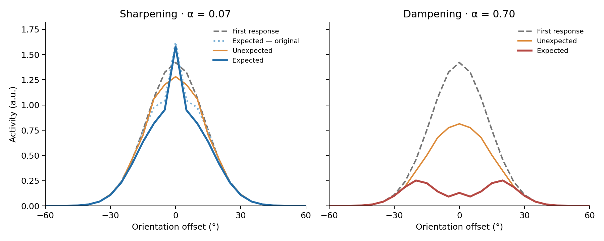
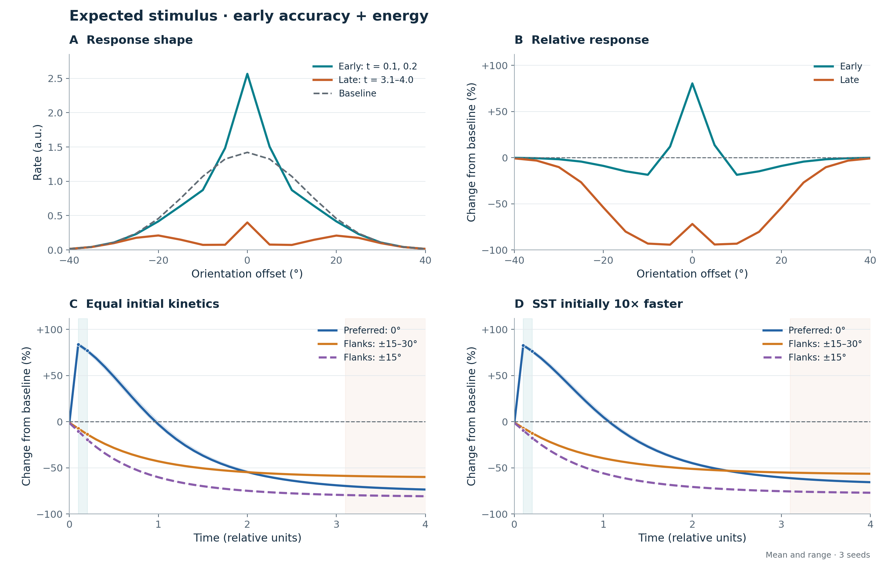
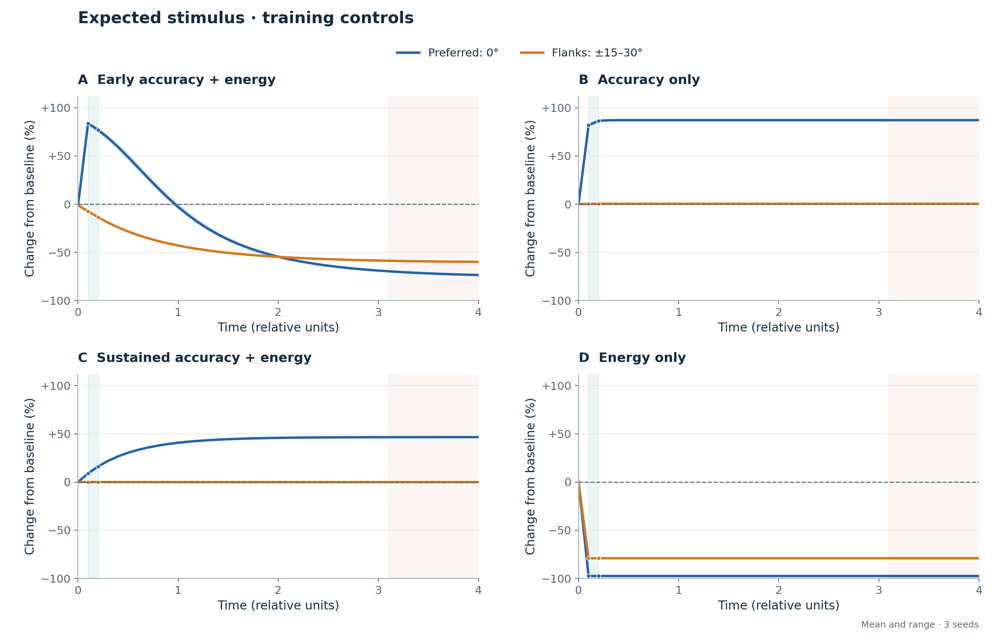

# Network guide: sharpening, dampening, and learned temporal responses

This branch, `networks-sharpening-dampening-temporal-v11`, packages the three
network types, their trained weights, numerical results, and executable
training/evaluation/plotting code. The scientific question is whether the
relative value of accurate representation and low activity can select different
orientation-response shapes, including a change of shape within one stimulus.

## Which network is which?

| Type | Architecture and training | Packaged result |
|---|---|---|
| **Sharpening** | Static v9, activity weight `alpha=0.07`. | Expected-orientation enhancement with suppression of nearby and broader flanks. |
| **Dampening** | The same static v9 circuit, `alpha=0.70`. | Strong central suppression with relative flank sparing and off-center response maxima. |
| **Temporal** | Learned v11, `alpha=0.30`, early decoding protected; excitatory and SST kinetics and gains train independently. | Early enhancement with flank suppression, followed by selective dampening relative to broader flanks. A narrow central peak remains. |

Sharpening and dampening are two trained regimes of the same architecture,
not separate implementations. The current temporal model is **v11**. The
previous **v10**, which imposed slow SST recruitment while excitation was
instantaneous, is retained as historical material. Its results do not establish
learned relative timing.

The current release contains **six static endpoints and fifteen v11 endpoints**
(three main temporal fits and twelve matched controls). Six older v10 endpoints
remain available separately. Seeds are 8, 9, and 10 throughout.

## Repository organization

```text
harness/
  simple_net.py                 orientation encoding and shared sequence utilities
  tuned_emergence_lib.py         shared circuit; v9, fixed v10, learned v11
  train_sweep.py                 task/activity losses and optimization
  train_temporal.py              reproduce the five packaged v11 conditions
reproduce_figures.py             evaluate the six static endpoints and plot them
tools/
  assay_emergent_task_energy_axis.py  shared probes, decoding, activity accounting
  evaluate_temporal.py           fresh evaluation of packaged v11 endpoints
  plot_learned_temporal.py       reproduce the two minimal-text v11 figures
  plot_temporal_profile.py       historical fixed-v10 figure
checkpoints/
  seed{8,9,10}/alpha0p07/         static sharpening
  seed{8,9,10}/alpha0p7/          static dampening
  temporal_v11/
    joint/seed_{8,9,10}/         main learned temporal model
    fast_sst/seed_{8,9,10}/      reversed initial timing control
    accuracy_only/seed_{8,9,10}/
    energy_only/seed_{8,9,10}/
    sustained/seed_{8,9,10}/     accuracy rewarded throughout the stimulus
    reference_limits.json       independent decoding-CE calibration
  temporal_v10/                 historical fixed-SST models and source pretrains
figures/
  c6_curves.json                six static response profiles and measurements
  temporal_v11/results.json     all fifteen learned-model measurements
  temporal_v11/*_minimal.*      current PNG/SVG figures
  temporal_v10/                 historical fixed-SST measurements and figures
tests/test_minimal_biology_circuit.py  existing circuit/compatibility checks
```

Each v11 condition/seed directory contains `alpha_*_final.pt`, its exact
`common_initial.pt`, and `training_summary.json`. Final checkpoints contain
configuration, weights, optimizer state, random-generator states, references,
and the completed training step. Evaluation reads configuration as well as
weights; it never infers the model version from a filename.

## Install and evaluate the packaged networks

Run from the repository root. CPU evaluation is supported.

```bash
git clone --branch networks-sharpening-dampening-temporal-v11 --single-branch \
    https://github.com/Vishnu-Mohan-USyd/neuroips.git
cd neuroips
python3 -m venv .venv
source .venv/bin/activate
python -m pip install -r requirements.txt
```

The checked environment uses Python 3.13.7, PyTorch 2.10.0, NumPy 2.3.5,
Matplotlib 3.10.8, and pytest 9.0.2. Package versions are pinned in
[requirements.txt](requirements.txt); the installed PyTorch CPU/CUDA build
is environment dependent.

Evaluate **sharpening and dampening**, all six static checkpoints:

```bash
CUDA_VISIBLE_DEVICES="" OMP_NUM_THREADS=2 MKL_NUM_THREADS=2 \
    python reproduce_figures.py
```

This writes the static PNG/SVG figures and `figures/c6_curves.json`. It checks
seed-8 banked measurements to tolerance `1e-3` and fails for missing or
incompatible checkpoints. The historical dotted v8 curve in the combined
figure is context, not part of the matched v9 comparison.

Evaluate **the learned temporal network and all controls**, all fifteen checkpoints:

```bash
CUDA_VISIBLE_DEVICES="" OMP_NUM_THREADS=2 MKL_NUM_THREADS=2 \
    python tools/evaluate_temporal.py \
    --out outputs/temporal_v11_evaluation/results.json
```

This performs fresh inference, including held-out decoding, response shapes,
fine activity integration, and the main models' fixed-weight interventions.
It uses no saved-result cache and requires all selected checkpoints. A smaller
selection can be evaluated with `--seeds 8 --conditions joint fast_sst`.
It does not train or modify the packaged networks.

Recreate the two current figures from the packaged numerical results:

```bash
python tools/plot_learned_temporal.py \
    --results figures/temporal_v11/results.json \
    --out-dir outputs/temporal_v11_figures
```

To plot a fresh evaluation, replace `--results` with its output JSON path.
The combined figures require all three seeds and all five conditions.
The plotter writes `temporal_response_minimal` and `temporal_controls_minimal`
as PNG and SVG. It performs no network evaluation.

## Shared circuit and input

The stimulus is an **orientation angle**, not an image or a spike train.
Orientations have 180-degree periodicity. A fixed circular-Gaussian L4 encoder
has 36 channels, spaced by 5 degrees, with a 12-degree tuning width. A fixed
nonnegative feedforward map produces sensory drive `D`.

| Component | Representation and function |
|---|---|
| Excitatory response `E` | 36 nonnegative orientation-channel rates; these are the plotted responses. |
| Sequence predictor | A 64-unit tanh `RNNCell` and a learned linear projection `W_fb` to 36 next-orientation logits. The legacy attribute name is `gru`. |
| Basal SST `S_B` | Sensory-driven inhibitory field using a nine-channel pooling basis; divides the sensory response. |
| Prediction SST `S_P` | Sensory–prediction coincidence recruits a 36-channel inhibitory field whose output is projected across E channels. |
| SST-like relay and VIP | Nine rectified prediction-driven relay channels inhibit nine VIP channels. VIP inhibits both SST fields. |
| PV | A scalar driven by mean pre-PV E activity, dividing all orientation channels. |

Incoming feedback `f` is the ordinary softmax prediction produced after the
**previous** stimulus. It is fixed during the current held stimulus. The first
stimulus starts with zero predictor state and zero feedback. No expected/
unexpected label enters the network or its loss.

With `p = f @ K_pred.T`, the static prediction-SST target is:

```text
S_P_target = relu(g_S * D * p - theta_S - w_sv * VIP_36)
```

`K_pred` is a fixed, circular, peak-normalized prediction footprint. The SST
output map `P = pred_inhib_weight` is a fixed positive, row-normalized Gaussian
with width two channels (10 degrees). Sensory SST and VIP are computed by the
same shared local circuit in all three types. The core E calculation is:

```text
basal = D / (1 + m * S_B)
u = excitation - m * (S_P @ P.T)
pre_PV = basal * (1 + tanh(u))
PV = w_pv * mean(pre_PV over orientation channels)
E = pre_PV / (1 + PV)
```

In static v9, `excitation = g_E * f` and `S_P = S_P_target` immediately.
The modulation is bounded between zero and twice the basal response before
PV scaling. Without sensory drive, the circuit cannot produce E firing.

The split SST fields, sensory–prediction multiplication, and fixed spatial
maps are architectural assumptions. The maps make particular spatial
interactions available; training does not discover arbitrary connectivity.
The local pathways have assigned excitatory/inhibitory signs, but the abstract
RNN has signed weights and states and is not a Dale-compliant neural circuit.
There are no spikes, explicit dendritic compartments, or local E-to-E recurrent
connections. Optional extra competition, adaptation, and rate saturation are
disabled in these fits.

## What changes in temporal v11?

V11 adds independent first-order dynamics for **effective excitatory prediction
activation** `x` and **actual prediction-SST firing** `z`. Both time constants
are positive learned parameters, with identical softplus parameterizations
and no imposed ordering:

```text
x_target = g_E * f
z_target = g_S * relu(D * p - theta_S - w_sv * VIP_36)

x(t) = x(0) * exp(-t/tau_E) + x_target * (1 - exp(-t/tau_E))
z(t) = z(0) * exp(-t/tau_S) + z_target * (1 - exp(-t/tau_S))

excitation = x(t)
S_P = z(t)
```

The model evaluates these trajectories analytically at the sampling times.
`x` is a visually gated synaptic/apical activation approximation, not another
firing population. `z` is the actual SST firing used both for inhibition and
for activity accounting.

**The SST gain placement is a real modeling change.** In v11, gain multiplies
the rectified prediction-SST response, whereas v9/v10 scale its input before
threshold. The earlier placement could create a completely silent branch
with zero gradients. The response-gain form keeps an active underlying drive
trainable even at small gain. It is a phenomenological recruitment gain,
not evidence for a specific biological plasticity rule. The same parameter
retains its existing input-gain role in the auxiliary SST-like relay to VIP.
The checkpoint key remains `w_sf_fixed`; configuration `sst_response_gain=true`
changes its interpretation to a positive softplus response gain.

| Protocol quantity | Value |
|---|---|
| Held stimulus | 4 relative time units |
| Following blank | 5 relative time units, including the terminal blank |
| Training samples | `t = 0, 0.1, ..., 4`, 41 samples |
| Early decoding times | `0.1` and `0.2` |
| Late response measurement | `3.1, 3.2, ..., 4.0` |
| Main initial time constants | `tau_E = tau_S = 1` |
| Reversed-timing initial constants | `tau_E = 1`, `tau_S = 0.1` |

Time is relative, not milliseconds. During a true zero-input blank, both
visually gated targets are zero and their states decay naturally. Predictor
memory is held. SST residual activity during every blank is charged using its
learned time constant. States reset only at the start of an independent sequence.

The RNN updates once per real stimulus using the **mean of the two noiseless
early E responses**. Its output predicts the next stimulus. Later within-stimulus
samples are not additional sequence elements or RNN updates.

V11 arm training updates the predictor, `W_fb`, excitatory prediction gain,
SST recruitment gain, and both time constants. Static v9 arm training updates
the predictor, `W_fb`, and the SST gain, with excitatory gain fixed. Sensory
maps, SST-to-E strength, local thresholds, inhibitory footprints, and other
local gains remain fixed. Loading old configuration preserves v9/v10 behavior.

## Accuracy and activity objectives

Training sequences contain 12 orientations with momentum, velocities up to
four channels per step, and sticky acceleration in `{-1,0,1}`. A 2% halt
probability is applied on eligible transitions whose preceding speed is at
least two channels per step. This modifies the sequence; it supplies no
expectation flag to the model.

The task includes next-orientation cross entropy and current-orientation
cross entropy from a noisy, confidence-weighted population-vector E decoder:

```text
T = (next_CE + current_CE) / (2 * log(36))
R(t) = (5/6) * mean(E) + (37/480) * mean(PV)
       + (1/20) * mean((S_B + S_P)/2) + (19/480) * mean(VIP)

static loss = (1-alpha) * T + alpha * mean(R) / R_ref
J = integral of R(t) over the stimulus and its following blank
temporal loss = (1-alpha) * T + alpha * J/J_ref
                + rho * relu(current_CE - ceiling)^2
```

The last penalty is optional and absent in the energy-only control. All
current guarded fits use **rho = 10000**. This is a finite quadratic penalty,
not a mathematical guarantee of feasibility; measured decoding CE must be
checked separately.

The ceiling is calibrated independently using each original common pretrain's
early decoding CE, on 1,024 twelve-stimulus sequences. Data/noise calibration
seeds are 920001/920002. The three ceilings are 1.79186219, 1.79186536, and
1.79186577. The calibration file's `original_setup_penalty_coefficient=1000`
records an earlier setup; actual checkpoint/measurement coefficients are
10000. The ceiling itself was unchanged.

For **early** training, `current_CE` averages two separately noisy decisions
at `0.1` and `0.2`. For **sustained** training, it averages separate decisions
at all 40 positive on-period samples. Total current-task weight is unchanged;
this is not a loss on temporally averaged rates. Sustained training also
applies the ceiling to that full-window mean, so it does **not** guarantee
the same early accuracy or a separate accuracy floor at every instant.

The activity penalty has **uniform weight per unit time**. There is no rising
late-time energy weight. On-period cost uses trapezoidal integration; blank
SST decay is integrated analytically. For fixed cycle duration, minimizing
the total is equivalent to minimizing its time average. Calibration references
and readout noise scale are held fixed across matched conditions.

`R` and `J` are population-weighted firing-activity proxies, not ATP estimates.
They charge actual E/PV/SST/VIP activity, but omit the predictor, auxiliary
relay, and detailed synaptic work. Excitatory activation `x` has no separate
population charge. The class fractions and cost model are fixed assumptions.

## Packaged results

The shape assay uses 216 matched continuation/reversal histories covering all
36 final orientations and six signed velocities. Expected and unexpected
histories end at the same stimulus. The first-stimulus response, before
feedback, supplies the sensory baseline and includes local SST/VIP/PV effects.
The x axis is **channel preference relative to the stimulus**, not a stimulus
sweep recorded from a single neuron. Broad flanks comprise ±15°, ±20°, ±25°,
and ±30°. Group rates are averaged before division by the corresponding
baseline. Expected-stimulus profiles are distinct from held-out decoding
measurements, which include the training distribution's sequence variability.

### Static sharpening and dampening

| Seed | Sharpening: preferred / baseline | Sharpening: broad flanks / baseline | Dampening: preferred / baseline | Dampening: broad flanks / baseline |
|---|---:|---:|---:|---:|
| 8 | 1.1145 | 0.8966 | 0.0914 | 0.4921 |
| 9 | 1.1104 | 0.8946 | 0.0902 | 0.4912 |
| 10 | 1.1107 | 0.8934 | 0.0906 | 0.4895 |

The sharpening fits suppress nearby channels as well as broader flanks. The
static dampening fits have off-center raw maxima near ±20°. The static regimes
trade task cost against activity; they are not a matched static-versus-temporal
comparison.



### Learned temporal network and controls

Each condition contains three 24,000-step fits from its seed's paired initial
weights. Names below are checkpoint subdirectories; result JSON keys retain
the `fitted_` prefix used during the experiment.

| Condition | Alpha | Current decoding window | Initial tau_E, tau_S | CE penalty |
|---|---:|---|---|---|
| `joint` | 0.30 | Early | 1, 1 | Early CE ceiling |
| `fast_sst` | 0.30 | Early | 1, 0.1 | Early CE ceiling |
| `accuracy_only` | 0 | Early | 1, 1 | Early CE ceiling |
| `energy_only` | 1 | Early metric recorded; no task reward | 1, 1 | None |
| `sustained` | 0.30 | Entire on-period | 1, 1 | Mean full-window CE ceiling |

Three-seed mean shape ratios:

| Condition | Early preferred | Early broad flanks | Late preferred | Late broad flanks |
|---|---:|---:|---:|---:|
| Joint | 1.805 | 0.895 | 0.281 | 0.406 |
| SST initially faster | 1.796 | 0.904 | 0.363 | 0.441 |
| Accuracy only | 1.841 | 1.003 | 1.871 | 1.003 |
| Energy only | 0.025 | 0.209 | 0.025 | 0.209 |
| Sustained accuracy + energy | 1.125 | 1.000 | 1.466 | 0.999 |



All six joint/reversed-initial-timing fits meet their early CE ceilings and
learn the same direction of transition. For the equal-initial-timing fits,
`tau_E` is 0.00675–0.00679 and `tau_S` is 1.072–1.081. Starting SST ten times
faster still yields fast excitation and slower SST recruitment. These are
learned effective constants, without physiological bounds or a millisecond mapping.

**The late shape is mixed.** The preferred channel is more suppressed than
the predefined broad-flank average, but nearby ±5–15° channels are more
suppressed than the preferred channel. A narrow central raw peak persists;
relative sparing is clearest at the farther flanks. All six main/reversed fits
fail the older strict gates requiring early ±5° suppression and a late raw
central trough. Those gates were not relaxed or represented as passing.
The result is selective dampening relative to broader flanks, not loss of
sharpening at every spatial scale.

Held-out three-seed mean decoding and activity:

| Condition | Early accuracy | Mean on-period accuracy | Activity / original common model |
|---|---:|---:|---:|
| Joint | 51.17% | 20.47% | 0.599 |
| SST initially faster | 51.06% | 21.90% | 0.615 |
| Accuracy only | 54.03% | 54.39% | 1.087 |
| Energy only | 8.18% | 8.03% | 0.347 |
| Sustained accuracy + energy | 48.37% | 50.63% | 1.012 |

Original common-model early accuracy is approximately 50.66%. Main joint fits
preserve that early decoding quality while reducing modeled activity by about
40%. Later current accuracy declines markedly. Next-prediction CE is not
separately constrained and can worsen. The sustained condition meets its
mean full-window CE ceiling, while its early CE exceeds the early benchmark.



Removing activity pressure yields continuing enhancement and negligible SST
recruitment. Removing task pressure yields immediate suppression and poor
decoding. Rewarding accuracy throughout preserves enhancement at the tested
activity weight. These comparisons support task-dependent selection of the
strategy; they do not establish a universal or monotonic dose-response law.

For the six primary/reversed fits, allowing SST recruitment to continue after
`0.2` reduces pooled expected/unexpected probe-cycle activity by **31.82–33.77%**
relative to freezing SST at its early level. Early responses are unchanged by
that intervention. With weights fixed, swapping the learned time constants,
setting both to the faster value, or setting both to the slower value violates
the early CE ceiling in all 18 comparisons. These interventions establish
utility of the fitted timing within the model; they do not establish a global optimum.

Held-out evaluation uses 1,024 twelve-stimulus sequences, data seed 930001,
early noise seed 930002, and other-time noise seed 930003. Fine activity and
kinetic-counterfactual measurements use `dt=0.025`. The saved JSON contains
full timecourses, per-seed values, component costs, and intervention results.

## Retraining

The recommended starting point for reproduction is the packaged checkpoint.
Training is stochastic and exact agreement across devices/software builds
is not promised.

### Static v9 from a common pretrain

```bash
for seed in 8 9 10; do
    CUBLAS_WORKSPACE_CONFIG=:4096:8 OMP_NUM_THREADS=2 MKL_NUM_THREADS=2 \
        python harness/train_sweep.py \
        --seed "$seed" --device cuda:0 --out outputs/static_v9_retrained \
        --pretrain-steps 12000 --axis-steps 12000 \
        --batch 128 --sequence-length 12 --mismatch-prob 0.02 \
        --lr 0.001 --clip 5 --alphas 0.07 0.70 \
        --feedback-mode posterior --recurrent-cell rnn_tanh \
        --axis-current-readout population_vector --freeze-local-comp
done
```

### Learned v11 from the exact packaged initial states

```bash
for seed in 8 9 10; do
    CUBLAS_WORKSPACE_CONFIG=:4096:8 OMP_NUM_THREADS=2 MKL_NUM_THREADS=2 \
        python harness/train_temporal.py \
        --seed "$seed" --device cuda:0 --out outputs/temporal_v11_retrained \
        --axis-steps 24000 --lr 0.003
done
```

The wrapper fixes the v11 temporal protocol and SST response-gain mode, and
learns both time constants and both prediction-route gains. It uses penalty
coefficient 10000, batches of 128 sequences of length 12, mismatch probability
0.02, gradient clipping 5, posterior feedback, a tanh RNN, the population-vector
current readout, and frozen local competition.
The wrapper runs the five declared conditions with their matching ceilings and
initial states. Use a fresh output directory for a new fit; existing arm
checkpoints resume their optimizer and random-generator states. CPU operation
uses `--device cpu`.

The v11 initial states are derived from the original per-seed 12,000-step
fixed-v10 common pretrains, with new time constants and the SST gain converted
to its softplus coordinate. They were not independently pretrained as v11.
Loading the packaged initial state preserves that exact starting point,
including the changed gain semantics. This command reproduces the v11 arm
training, not a new claim of v11 training from scratch. Optimization uses Adam,
learning rate 0.003, batch 128, and gradient clipping at 5 for 24,000 total steps.

## Load any of the three types in Python

```python
import sys
import torch
sys.path.insert(0, "tools")
import assay_emergent_task_energy_axis as assay

paths = {
    "sharpening": "checkpoints/seed8/alpha0p07/alpha_0p07_final.pt",
    "dampening": "checkpoints/seed8/alpha0p7/alpha_0p7_final.pt",
    "temporal": "checkpoints/temporal_v11/joint/seed_8/alpha_0p3_final.pt",
}
from pathlib import Path
device = assay.choose_device("cpu")  # also moves the fixed orientation preferences
net, checkpoint = assay.load_arm(Path(paths["temporal"]), device)
orientations = torch.tensor([[0., 10., 20., 30., 40.]], device=device)
with torch.no_grad():
    result = assay.tuned.forward_seq_tuned(
        net, orientations, 1.0,
        center_feedback=checkpoint["center_feedback"],
        feedback_mode=checkpoint["feedback_mode"],
        return_timecourse=net.temporal_protocol is not None,
    )
logits, rates = result[:2]  # [batch, real stimuli, 36]
if net.temporal_protocol is not None:
    trace = result[2]
    times = trace["times"]       # [41], time within a held stimulus
    rates_over_time = trace["rates"]  # [batch, real stimuli, 41, 36]
```

Static `rates` are the instantaneous responses; temporal `rates` are the
`t=4` endpoints. Inspect `rates_over_time` for the early/late transition. Both
model configuration and weights must be loaded. Checkpoint files are trusted
project artifacts and contain Python/PyTorch training state.

## Scope of the scientific inference

The old fixed-SST ordering is no longer imposed, and no sharpening/dampening
shape term or timed switch is present in the loss. The circuit learns a useful
temporal strategy under the specified early-decoding and activity objectives.
The early priority is deliberately part of the task, not an independently
emerged preference.

Biological interpretation remains a modeling hypothesis. First-order dynamics,
fixed spatial connectivity, response-gain placement, backpropagation, unbounded
positive effective kinetics/gains, and incomplete energy accounting are
explicit approximations. They do not themselves demonstrate an artifact,
but these experiments do not validate a particular in-vivo learning mechanism,
physiological time constant, or ATP saving.

Qualitative biological context includes broad SOM targeting
([Wilson et al., 2012](https://pmc.ncbi.nlm.nih.gov/articles/PMC3653570/)),
feedback-driven dendritic events
([Fişek et al., 2023](https://www.nature.com/articles/s41586-023-06007-6)), and
heterogeneous fast/slow excitatory inputs onto SOM neurons
([Grier et al., 2023](https://pmc.ncbi.nlm.nih.gov/articles/PMC10630508/)).
These findings motivate circuit abstractions; they do not establish the
specific learned parameters or this task-dependent temporal strategy.

## Historical v10 and compatibility

Old v10 uses `split_som_projected_output_temporal_v10`; current v11 uses
`split_som_projected_output_learned_temporal_v11`. Static v9 uses
`split_som_projected_output_tanh_v9`. Existing configurations without the
new options retain their original behavior.

The fixed-v10 low/high activity arms, common pretrains, and original plots are
retained in `checkpoints/temporal_v10` and `figures/temporal_v10`. Their
historical two-arm assay is `tools/assay_emergent_task_energy_axis.py`;
use `tools/evaluate_temporal.py` for the current v11 package.

Run the existing circuit checks with:

```bash
CUDA_VISIBLE_DEVICES="" OMP_NUM_THREADS=2 MKL_NUM_THREADS=2 \
    python -m pytest -q tests/test_minimal_biology_circuit.py
```

## Validation of this package

Validation passed in the CPU environment listed above:

- All 43 existing circuit tests passed.
- Fresh evaluation of all six static endpoints exactly reproduced all 672
  numerical fields in the packaged static results.
- Fresh evaluation of all fifteen v11 endpoints exactly reproduced all 88,416
  numerical fields and all 30 Boolean results in the packaged temporal JSON.
- All fifteen v11 final checkpoints and their fifteen paired initial files are
  byte-identical to the original experiment artifacts. Every final fit completed
  24,000 updates.
- The documented loading examples ran for all three network types. Both
  temporal PNG/SVG figure pairs were regenerated and visually checked.
- The temporal training entry point completed one update for each of the five
  conditions, with the original batch and sequence sizes and the correct
  objective windows, gains, kinetics, and CE penalties. This checks the runnable
  training path; the full 24,000-step fits were not retrained during packaging.
