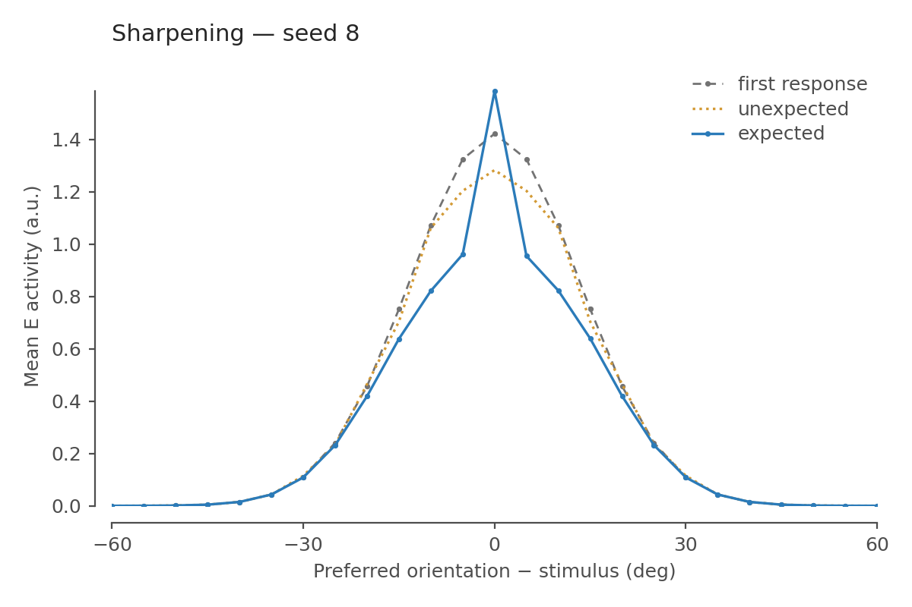
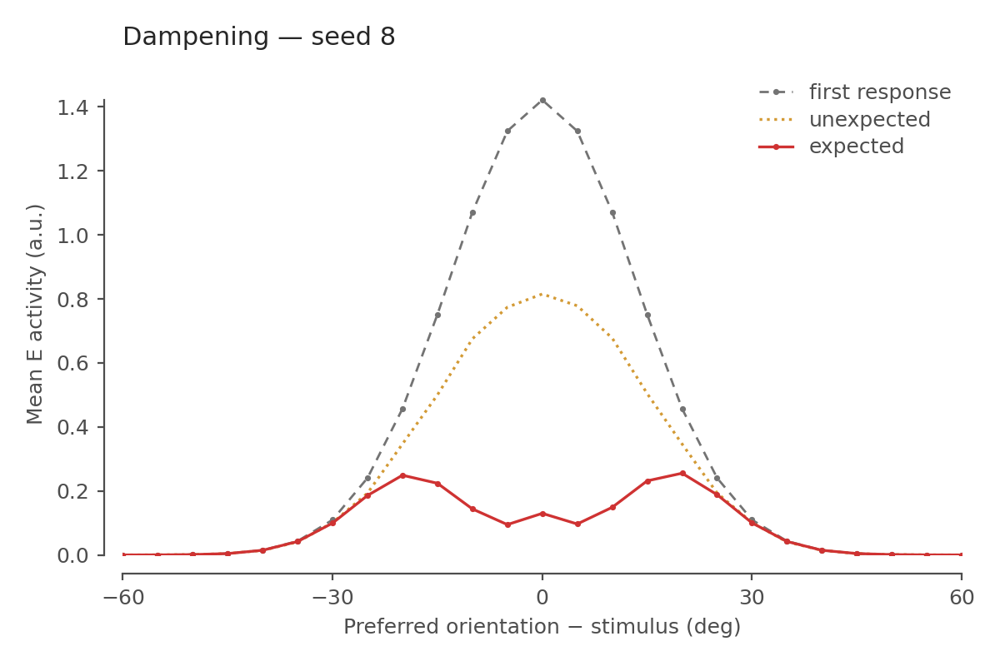
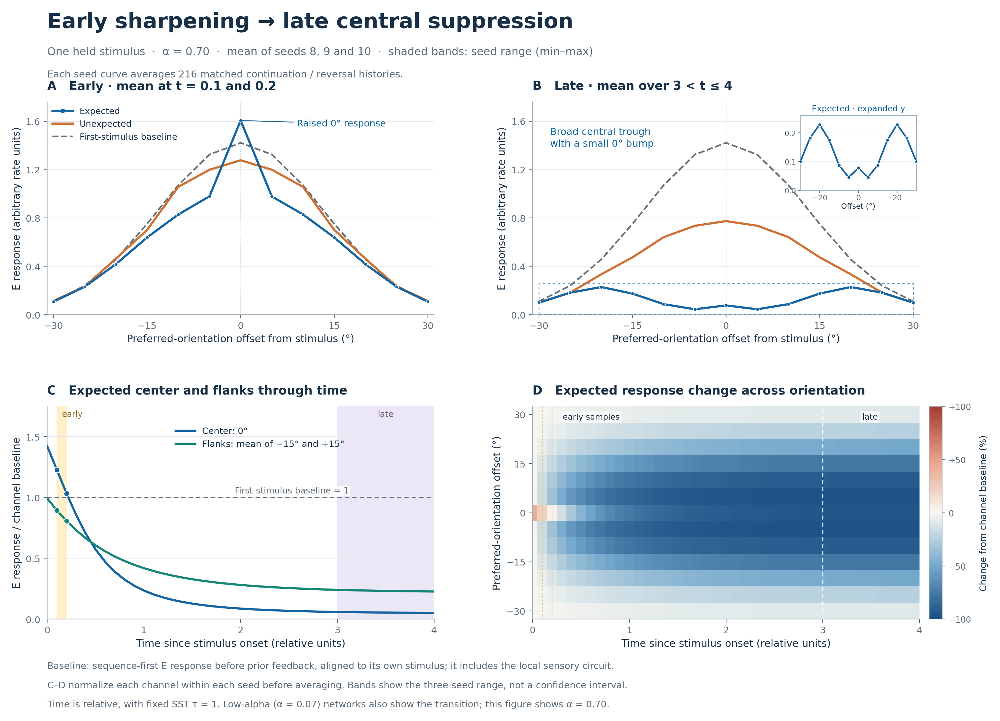

# Network guide: sharpening, dampening, and temporal responses

## The three packaged network types

All three types are included in the `temporal-sst-v10` branch. Sharpening and
dampening are separately trained parameterizations of the same v9 rate
architecture. Temporal v10 adds within-stimulus prediction-SST dynamics and
an early decoding deadline to that shared circuit.

| Type | Response shape | Time treatment | Packaged final networks |
|---|---|---|---|
| **Sharpening: v9, alpha 0.07** | The expected orientation is enhanced; neighboring orientations and flanks are suppressed relative to the first-response baseline. | One instantaneous circuit response per real stimulus; the RNN carries prediction across stimuli. | Three seeds: `checkpoints/seed{8,9,10}/alpha0p07/alpha_0p07_final.pt`. |
| **Dampening: v9, alpha 0.70** | The expected orientation is strongly suppressed, with relative sparing of the flanks and a broad central dip. | The same instantaneous v9 circuit and sequence predictor. | Three seeds: `checkpoints/seed{8,9,10}/alpha0p7/alpha_0p7_final.pt`. |
| **Temporal: v10** | Early center enhancement with flank suppression evolves into late central suppression within one held stimulus. | One dynamic prediction-SST state, a four-unit stimulus, and a five-unit blank; one RNN update per stimulus. | Six endpoints: `checkpoints/temporal_v10/seed_{8,9,10}/alpha_{0p07,0p7}_final.pt`; low/high alpha form the matched comparison. |

There are **12 trained endpoints** in total. Each seed also includes its common
task pretrain and training summary. For v9, the same seed's pretrain is packaged
in both arm directories; for v10, the two arms share one pretrain file beside
them. The temporal alpha-0.07 control is a temporal network, not the original
static sharpening checkpoint.

The common implementation is [tuned_emergence_lib.py](harness/tuned_emergence_lib.py).
Both v9 types use architecture `split_som_projected_output_tanh_v9`, with no
temporal protocol. V10 uses `split_som_projected_output_temporal_v10`. Checkpoint
configuration selects the correct forward path; there are no separate copies
of the circuit for sharpening and dampening.

## Install once for all three types

Run subsequent commands from the repository root:

```bash
git clone --branch temporal-sst-v10 --single-branch \
    https://github.com/Vishnu-Mohan-USyd/neuroips.git
cd neuroips
python3 -m venv .venv
source .venv/bin/activate
python -m pip install -r requirements.txt
```

## Static sharpening and dampening: architecture and results

The v9 sensory encoder has 36 circular-Gaussian orientation channels spaced by
5 degrees, with a 12-degree tuning width. A fixed nonnegative map supplies E
drive. The local rate circuit contains sensory-driven SST (`S_B`),
prediction-recipient SST (`S_P`), a prediction-driven inhibitory relay, VIP,
and a broad PV divisor. The local components are described in the circuit table
below; in v9, **prediction SST is evaluated algebraically at its target**.
There is no SST trajectory or physical dwell/blank interval.

Previous-stimulus softmax feedback supplies the current prediction. Sensory
drive multiplied by the smoothed prediction recruits `S_P`; VIP inhibits both
SST pools. Basal SST divides sensory drive, while direct excitatory feedback
competes with the spatially projected prediction-SST output. The resulting E
response updates the 64-unit tanh RNN once, producing the next prediction.
The first stimulus has zero RNN state and incoming feedback.

Both static types share the same equations and fixed local maps. Common task
pretraining updates the RNN and `W_fb`; each alpha arm also learns the shared
prediction-to-SST strength `w_sf_fixed`. RNN and feedback weights also change
during arm training. Learned `w_sf` is 1.6163–1.6600 for sharpening and
9.0528–9.1010 for dampening. These fitted weights produce the two shapes.

Static training uses one noisy current-orientation decision per stimulus:

```text
T_v9 = 0.5 * next_CE / log(36) + 0.5 * current_CE / log(36)
loss_v9 = (1 - alpha) * T_v9 + alpha * mean(R) / R_ref
```

`R` is the instantaneous weighted E/PV/SST/VIP activity defined below. The v9
objective has no within-stimulus integral or early readout window. The two
alpha values were selected after examining v9 training results to obtain the
two response regimes. Neither shape is directly included in the loss.

The 216-pair continuation/reversal assay measures the expected response
relative to the model's first-stimulus baseline. A value above one means
enhancement; below one means suppression. Flanks pool offsets of ±15°, ±20°,
±25°, and ±30°.

| Seed | Sharpening: 0° / baseline | Sharpening: flanks / baseline | Dampening: 0° / baseline | Dampening: flanks / baseline |
|---|---:|---:|---:|---:|
| 8 | 1.1145 | 0.8966 | 0.0914 | 0.4921 |
| 9 | 1.1104 | 0.8946 | 0.0902 | 0.4912 |
| 10 | 1.1107 | 0.8934 | 0.0906 | 0.4895 |

Sharpening therefore enhances the exact expected channel by about 11% while
suppressing the flanks by about 10–11%. Dampening suppresses the expected
channel by about 91%, versus about 51% at the flanks. The dampening profile's
raw maxima are near ±20°, away from its suppressed central region. In seed 8,
the raw center is 0.12993 versus 0.22770 averaged at ±15°.

| Sharpening, seed 8 | Dampening, seed 8 |
|---|---|
|  |  |

[Three-seed comparison](figures/c6_shared_task_energy_seed_mean.png) ·
[all six numerical profiles](figures/c6_curves.json).
The dotted historical v8 curve in the combined static figure is context;
the solid curves are the matched v9 networks.

Stronger static activity pressure carries a task cost. On the recorded shared
seed-8 held-out batches, normalized modeled activity fell from 0.8914 to 0.4363,
while normalized task cost rose from 0.3472 to 0.5581 and next accuracy fell
from 80.12% to 75.55%. This static comparison uses a different current-task
timing rule from v10, so its numbers are not a matched static-versus-temporal
experiment.

### Evaluate or retrain the static types

Evaluate all six packaged sharpening and dampening endpoints on CPU:

```bash
CUDA_VISIBLE_DEVICES="" OMP_NUM_THREADS=2 MKL_NUM_THREADS=2 \
    python reproduce_figures.py
```

This writes the individual and combined static figures and `figures/c6_curves.json`.
All six v9 endpoints were replayed after the temporal implementation; all 672
numeric values matched the original reference exactly. The temporal changes
preserve the original default forward path.

For the fuller per-arm assay, these seed-8 commands select each static type:

```bash
CUDA_VISIBLE_DEVICES="" OMP_NUM_THREADS=2 MKL_NUM_THREADS=2 \
    python tools/assay_emergent_task_energy_axis.py \
    --run-dir checkpoints/seed8/alpha0p07 --alphas 0.07 --device cpu \
    --out outputs/static_v9_evaluation/seed8_sharpening.json

CUDA_VISIBLE_DEVICES="" OMP_NUM_THREADS=2 MKL_NUM_THREADS=2 \
    python tools/assay_emergent_task_energy_axis.py \
    --run-dir checkpoints/seed8/alpha0p7 --alphas 0.70 --device cpu \
    --out outputs/static_v9_evaluation/seed8_dampening.json
```

Use `seed9` or `seed10` to select the other packaged seeds. To train both static
types from a common pretrain, the v9 command is:

```bash
for seed in 8 9 10; do
    CUBLAS_WORKSPACE_CONFIG=:4096:8 OMP_NUM_THREADS=2 MKL_NUM_THREADS=2 \
        python harness/train_sweep.py \
        --seed "$seed" --device cuda:0 --out outputs/static_v9_retrained \
        --pretrain-steps 12000 --axis-steps 12000 \
        --batch 128 --sequence-length 12 --mismatch-prob 0.02 \
        --lr 0.001 --clip 5 --alphas 0.07 0.70 \
        --feedback-mode posterior --recurrent-cell rnn_tanh \
        --axis-current-readout population_vector --freeze-local-comp
done
```

The absence of `--temporal-v10` selects v9. Use a fresh output directory for a
new run. CPU training is available with `--device cpu`; the packaged weights
are the reference results.

## Load any of the three types in Python

Change `kind` to select the seed-8 sharpening, dampening, or temporal network:

```python
import sys
import torch

sys.path.insert(0, "harness")
import simple_net as simple
import tuned_emergence_lib as tuned

device = torch.device("cpu")
simple.device = tuned.device = device
simple.prefs = torch.arange(36, device=device).float() * 5.0
paths = {
    "sharpening": "checkpoints/seed8/alpha0p07/alpha_0p07_final.pt",
    "dampening": "checkpoints/seed8/alpha0p7/alpha_0p7_final.pt",
    "temporal": "checkpoints/temporal_v10/seed_8/alpha_0p7_final.pt",
}
kind = "temporal"
checkpoint = torch.load(paths[kind], map_location=device, weights_only=False)
net = tuned.build_tuned_from_config(checkpoint["tuned_net_config"]).to(device)
net.load_state_dict(checkpoint["state_dict"], strict=True)
net.eval()
orientations = torch.tensor([[0., 10., 20., 30., 40.]], device=device)
with torch.no_grad():
    result = tuned.forward_seq_tuned(
        net, orientations, 1.0,
        center_feedback=checkpoint["center_feedback"],
        feedback_mode=checkpoint["feedback_mode"],
        return_timecourse=net.temporal_protocol is not None,
    )
logits, rates = result[:2]  # [batch, real stimuli, 36]
if net.temporal_protocol is not None:
    trace = result[2]
    times = trace["times"]   # [41], relative time within each stimulus
    temporal_rates = trace["rates"]  # [batch, real stimuli, 41, 36]
```

For v9, `rates` is the instantaneous E response at each stimulus. For v10 it is
the endpoint at `t=4`; use `temporal_rates` to inspect early or intermediate
responses. The temporal low-pressure control is selected by replacing its
filename with `alpha_0p07_final.pt`. Load checkpoint configuration as well as
weights, since configuration determines whether the network has temporal
dynamics. Checkpoints contain training state; use trusted checkpoint files.

## Temporal v10: early sharpening and late suppression within one stimulus

The `temporal-sst-v10` branch extends the [v9 rate circuit](README.md) with one dynamic prediction-recipient SST firing field. During a held orientation, inhibition builds while the incoming prediction stays fixed. The trained network first gives a sharper expected response, then develops a strongly suppressed central region.

**Both alpha arms show this temporal transition in all three seeds.** The high-pressure arm, `alpha = 0.70`, saves additional modeled activity relative to the matched `alpha = 0.07` control. The transition itself is therefore not unique evidence for stronger activity pressure.



[Vector figure](figures/temporal_v10/temporal_shape_profile.svg). Lines are three-seed means; shading is the min–max seed range, not a confidence interval. The late response retains a small bump at exactly 0° inside a broader central trough. The inset preserves that feature.

## Evaluate the packaged checkpoints on CPU

Use the environment installed above. [Requirements](requirements.txt) pin PyTorch 2.10.0, NumPy 2.3.5, Matplotlib 3.10.8, and pytest 9.0.2. The recorded environment used Python 3.13.7; a CUDA build of PyTorch can also evaluate these checkpoints on CPU.

```bash
for seed in 8 9 10; do
    CUDA_VISIBLE_DEVICES="" OMP_NUM_THREADS=2 MKL_NUM_THREADS=2 \
        python tools/assay_emergent_task_energy_axis.py \
        --run-dir "checkpoints/temporal_v10/seed_${seed}" \
        --alphas 0.07 0.70 --device cpu \
        --out "outputs/temporal_v10_evaluation/seed_${seed}/temporal_assay.json"
done
```

The assay detects v10 from the common checkpoint and requires both alpha arms. It evaluates the common pretrain, both endpoints, the final-probe SST clamp, and activity integration at `dt = 0.05` as well as `0.1`. It writes JSON and matching PNG/SVG plots beside each requested output. It does not train or modify checkpoint weights.

The packaged CPU replay was checked against the original saved results: all five acceptance gates passed in each seed, and all **49,194 numeric JSON values** matched exactly, with maximum difference `0.0`. Checkpoint-path strings change with their location. This is a result for the checked environment; numerical identity across other devices or software builds is not promised.

Recreate the combined four-panel shape figure from the saved JSON alone:

```bash
python tools/plot_temporal_profile.py \
    --results-root figures/temporal_v10 \
    --out outputs/temporal_shape_profile
```

Those are also the plotting CLI defaults. To plot freshly evaluated results, change `--results-root` to `outputs/temporal_v10_evaluation`. The plotting script reads only the three seed JSON files and writes PNG/SVG; it performs no network evaluation.

## Circuit and the single dynamic state

The implementation is in [tuned_emergence_lib.py](harness/tuned_emergence_lib.py). Input is orientation in degrees with 180° periodicity. E rates are nonnegative arbitrary activity units.

| Component | Representation and role |
|---|---|
| Sensory encoder and feedforward drive `D` | 36 fixed orientation channels, spaced by 5°; fixed nonnegative feedforward map. |
| E | 36 orientation channels; these final rates are measured. |
| Basal SST, `S_B` | Sensory-driven 36-channel inhibitory field, using a nine-channel pooling basis. |
| Prediction SST, `z` | One **36-channel state tensor**, representing actual prediction-recipient SST firing. This is the only new dynamic population state. |
| SST-like relay and VIP | Nine relay channels recruit inhibition of nine VIP channels; VIP inhibits both SST pools. These rates remain instantaneous. |
| PV | One broad activity-driven divisive scalar, computed from mean pre-PV E activity. |
| Temporal predictor | A 64-unit native tanh RNN and learned linear feedback projection `W_fb`. Its legacy code attribute is `gru`. |

For fixed sensory drive and incoming prediction `f`, the existing prediction-SST target is

```text
z_target = relu(w_sf * D * (f @ K_pred.T) - theta_S - w_sv * V_36)
```

`K_pred` is the fixed prediction footprint and `V_36` is projected VIP activity. The new state follows

```text
tau_P * dz/dt = z_target - z
z(t) = exp(-t/tau_P) * z(0) + (1 - exp(-t/tau_P)) * z_target
```

Because sensory input and prior feedback are fixed during the dwell, `z_target` is constant. The implementation evaluates this exact trajectory at all sample times in one vectorized calculation. It delays actual SST recruitment, not just the effect of an already active SST population.

The existing E calculation uses that same actual state:

```text
SST = (S_B + z) / 2
basal = D / (1 + m * S_B)
projected_prediction_SST = z @ pred_inhib_weight.T
pre_PV = basal * (1 + tanh(w_ef * f - m * projected_prediction_SST))
PV = w_pv * mean(pre_PV over orientation channels)
E = pre_PV / (1 + PV)
```

The positive, row-normalized prediction-SST output map has sigma 2 channels, or 10°. Its geometry is fixed. Modulation remains bounded between zero and twice the basal response before PV scaling. Sensory–prediction multiplication and the split SST pools are imposed wiring assumptions.

## Two clocks and causal feedback

| Protocol value | Fixed setting |
|---|---:|
| SST time constant `tau_P` | 1 relative unit |
| Stimulus duration | 4 relative units |
| Following blank | 5 relative units |
| Main sampling interval | 0.1; 41 samples at `0, 0.1, …, 4` |
| Early decisions | Exactly `t = 0.1` and `0.2` |
| Late measurement window | `3 < t <= 4`; ten samples at the main resolution |

These are relative units, not milliseconds. The same numerical early times remain in place for the finer `dt = 0.05` integration check.

At the start of each independent sequence, SST state, RNN state, and incoming feedback are zero. Within each stimulus, L4 input and the previous stimulus's feedback remain fixed. The RNN updates **once per real stimulus**, using the mean of the two noiseless early E responses. Its new logits predict the next orientation and become feedback only for the following stimulus. Repeated dwell samples are not additional sequence elements or additional next-orientation targets.

During the blank, sensory input is truly zero; an orientation of 0° would still be a visible stimulus and is not used as a blank. Basal SST, VIP, E, and PV are then zero in the accounted circuit. Prediction-SST decays naturally:

```text
z_next_onset = exp(-5/tau_P) * z_at_offset
```

The residual is retained, about `0.006738 * z_at_offset` for this protocol. RNN memory is held through the blank. The final stimulus also incurs its following blank activity cost.

`forward_seq_tuned` preserves the ordinary endpoint outputs: logits and E each have shape `[batch, sequence_length, 36]`. With `return_timecourse=True`, an additional dictionary provides `times`, rates `[B,S,K,36]`, the existing eight internals at each sample, and population-weighted blank integrals `[B,S]`. `return_internals=True` still adds endpoint internals. The internal `clamp_final_probe_sst` option is an assay intervention, not a training CLI feature.

## Task and activity objective

[train_sweep.py](harness/train_sweep.py) retains the same two task components:

```text
current_CE = mean(CE_at_0.1, CE_at_0.2)
T = 0.5 * next_CE / log(36) + 0.5 * current_CE / log(36)
loss = (1 - alpha) * T + alpha * mean(J) / J_ref
```

Each current decision independently applies the existing Gaussian noise and ReLU to its instantaneous E response. The fixed doubled-angle population-vector decoder weights direction by confidence; its gain is 8 and detached from learning. The noise tensor has shape `[B,S,2,36]`. The decoder does **not** operate on a noisy average of the two responses. Only the RNN receives their noiseless average.

Next CE compares the first `S-1` predictions with the following `S-1` real stimuli. Current CE includes both early decisions at all `S` stimuli. Late current decoding is measured but has no separate task penalty.

Instantaneous modeled population activity is

```text
R(t) = (5/6) * mean(E)
     + (37/480) * mean(PV)
     + (1/20) * mean(SST)
     + (19/480) * mean(VIP)

J_on = trapezoid integral of R(t), from t=0 to t=4
J_gap = mean(z_at_offset) * tau_P * (1 - exp(-5/tau_P)) / 40
J = J_on + J_gap
```

The blank's `1/40` factor includes the SST weight `1/20` and prediction SST's half share of the two SST pools. Both the state trajectory and blank integral are analytic; the nonlinear on-period E/PV integral uses trapezoidal quadrature. `temporal_activity_integrals` is shared by training and the assay.

References are measured before pretraining using all 36 orientations with zero feedback and zero prior SST state. `R_ref = 0.2200898528` is the original instantaneous sensory baseline. The integral reference is **`J_ref = 4 * R_ref = 0.8803594112`**, corresponding to the same stimulus-plus-blank schedule at zero feedback. A long blank therefore cannot dilute the normalized cost merely by adding silent time. Diagnostic full-cycle class means use the nine-unit cycle duration; the training objective uses `J/J_ref`.

The decoder reference is unchanged: `A_ref = 1.421364069`, the median peak sensory response, and `sigma_train = 0.25 * A_ref = 0.355341017`. These are fixed absolute noise units, not a noise level scaled down with the suppressed response.

`R` and `J` are activity proxies, not ATP consumption. They omit RNN activity, the inhibitory relay, and synaptic-operation costs.

## Training protocol and retraining

Seeds **8, 9, and 10** each have a 12,000-step common temporal pretrain followed by two 12,000-step arms. Common pretraining optimizes `T` alone and trains the RNN and `W_fb`. Each arm clones that same seed's common state, starts a fresh Adam optimizer, and additionally trains the shared nonnegative prediction-to-SST recruitment strength `w_sf_fixed`. Despite its name, this parameter is trainable in the arms. It also controls the instantaneous SST-like relay.

Local gains, thresholds, feedforward maps, SST output geometry, and the time constant remain fixed. Feedback-gain learning is off. Extra local competition, adaptation, and optional rate saturation are disabled. Learned `w_sf` spans 9.6597–9.6860 for alpha 0.07 and 10.6625–10.6632 for alpha 0.70.

Training batches contain 128 momentum sequences of 12 orientations. Initial position is uniform; velocity is bounded at ±4 channels per stimulus. Acceleration is in `{-1,0,1}`, retaining the previous value with probability 0.9 and otherwise resampling uniformly. Eligible transitions with preceding speed at least two channels halt with probability 0.02. Halts change the sequence; no halt or expected/unexpected label enters the model.

Adam uses learning rate `0.001`, betas `(0.9,0.999)`, epsilon `1e-8`, and gradient-norm clipping at 5. Pretraining data/noise seeds are `200000+seed` and `300000+seed`; both arms restart data/noise streams at `400000+seed` and `500000+seed`. Their input batches and decoder-noise draws are therefore paired. All three seeds used the same fixed timing and alpha values. Endpoints are fixed-step finals, not checkpoints selected by a validation shape score.

Use a **fresh output directory** for retraining. The trainer automatically resumes compatible final/latest checkpoints if they already exist.

```bash
for seed in 8 9 10; do
    CUBLAS_WORKSPACE_CONFIG=:4096:8 OMP_NUM_THREADS=2 MKL_NUM_THREADS=2 \
        python harness/train_sweep.py \
        --temporal-v10 --seed "$seed" --device cuda:0 \
        --out outputs/temporal_v10_retrained \
        --pretrain-steps 12000 --axis-steps 12000 \
        --batch 128 --sequence-length 12 --mismatch-prob 0.02 \
        --lr 0.001 --clip 5 --alphas 0.07 0.70 \
        --feedback-mode posterior --recurrent-cell rnn_tanh \
        --axis-current-readout population_vector --freeze-local-comp \
        --log-every 100 --checkpoint-every 250
done
```

CPU training uses `--device cpu`. The packaged endpoints were trained on CUDA; CPU and CUDA RNG streams can yield different fitted weights. `--temporal-v10` selects the temporal protocol but does not replace the general trainer's numeric defaults, so retain the explicit settings above.

Optimizer and data/noise-generator states are checkpointed. Resume validates the architecture, training version, temporal protocol, and the existing stage-specific metadata. Keep the same backend and all training settings when resuming. Cumulative halt counters in the active alpha path restart after resumption, so resumed summary counts are not full-run counts.

Evaluate a retrained pair by using `outputs/temporal_v10_retrained/seed_8` as the assay's `--run-dir`, with the same paired alphas and a separate `--out` as in the CPU command above.

## Measurements, gates, and saved results

The probe contains 216 matched pairs: all 36 final orientations and velocities in `{-3,-2,-1,1,2,3}` channels per stimulus. Expected histories continue their trajectory; unexpected histories reverse at the last transition. Both end at the same orientation. This reversal is an operational sequence violation outside the ordinary continuation pattern.

Profiles align E channels to the final stimulus and average over histories. The orientation axis describes **neurons' preferred orientations relative to that stimulus**, not different probe stimuli presented to one neuron. Baseline is the sequence-first E response before prior feedback, aligned to its own first stimulus and averaged across both history sets. It includes sensory SST/VIP/PV processing.

The exact shape gates operate on window-averaged, history-averaged curves:

| Gate | Required conditions |
|---|---|
| Early sharpening | Expected 0° / baseline 0° **> 1.02**; pooled ±5° ratio **< 0.98**; pooled ±15°, ±20°, ±25°, ±30° ratio **< 0.98**. |
| Late dampening | Expected 0° / baseline 0° **< 0.98**; raw expected 0° **<= 0.95 ×** mean raw expected ±15°; late expected mean over all 36 channels **<** the early expected mean. |

Pooled gate ratios divide pooled expected means by pooled baseline means. The combined shape figure's normalized time curves/heatmap instead normalize each channel within each seed before averaging; its flank time curve uses only ±15°.

| Seed | Alpha | Early 0° / baseline | Early ±5° / baseline | Early ±15–30° / baseline | Late 0° / baseline | Late raw 0° / ±15° |
|---|---:|---:|---:|---:|---:|---:|
| 8 | 0.07 | 1.1542 | 0.7670 | 0.9071 | 0.0830 | 0.5666 |
| 8 | 0.70 | 1.1253 | 0.7409 | 0.8965 | 0.0543 | 0.4409 |
| 9 | 0.07 | 1.1587 | 0.7644 | 0.9065 | 0.0823 | 0.5651 |
| 9 | 0.70 | 1.1310 | 0.7382 | 0.8962 | 0.0542 | 0.4419 |
| 10 | 0.07 | 1.1611 | 0.7624 | 0.9068 | 0.0827 | 0.5676 |
| 10 | 0.70 | 1.1332 | 0.7369 | 0.8964 | 0.0546 | 0.4443 |

All six endpoints satisfy both shape gates. The common pretrain satisfies neither in any seed. High-alpha late center rates are 0.07707–0.07762 versus 0.17440–0.17490 at ±15°. The center remains above its immediate ±5° neighbors: this is a broad central-region dip with a residual central bump, not a smooth notch with its minimum at 0°.

Held-out task/activity measurements use eight shared batches of 128 length-12 momentum histories, 2% eligible halts, data seed `930001`, and noise seed `930002`. Current accuracy uses the same two instantaneous early decisions and fixed decoder as training. The matched-probe decoding timecourse separately uses 32 shared noise repeats with seed `910002`.

| Seed | Early accuracy, low / high (%) | Next accuracy, low / high (%) | `J/J_ref`, low / high | High-alpha activity saving (%) | Saving versus SST clamp (%) |
|---|---:|---:|---:|---:|---:|
| 8 | 42.525 / 41.532 | 80.558 / 80.575 | 0.54430 / 0.52667 | 3.238 | 31.182 |
| 9 | 42.550 / 41.532 | 80.558 / 80.531 | 0.54398 / 0.52662 | 3.190 | 31.157 |
| 10 | 42.505 / 41.463 | 80.762 / 80.779 | 0.54360 / 0.52653 | 3.141 | 31.176 |

The accepted early-accuracy loss was at most five percentage points versus the low-alpha control; observed losses were 0.993, 1.017, and 1.042 points. This is a relative preservation criterion under substantial fixed noise, not a claim of near-perfect absolute decoding. Late decoding is allowed to decline.

The SST clamp freezes the actual final-probe state after `t=0.2` until offset, then releases it to its own natural blank decay. Weights, early responses, incoming feedback, and stimulus duration are shared. Its activity comparison uses the pooled expected/unexpected final-probe cycle; the low/high-alpha comparison uses held-out momentum cycles. Both charge the relevant terminal SST decay.

For acceptance, each activity saving must exceed the sum of the absolute `dt=0.1` versus `0.05` integral differences for the two compared cases. All three high-alpha endpoints pass these two activity gates, the early-accuracy gate, and both shape gates. The saved resolution differences are numerical checks, not formal error bounds or statistical confidence intervals.

Full measurements and plots: [seed 8 JSON](figures/temporal_v10/seed_8/temporal_assay.json), [PNG](figures/temporal_v10/seed_8/temporal_assay.png), [SVG](figures/temporal_v10/seed_8/temporal_assay.svg); [seed 9 JSON](figures/temporal_v10/seed_9/temporal_assay.json), [PNG](figures/temporal_v10/seed_9/temporal_assay.png), [SVG](figures/temporal_v10/seed_9/temporal_assay.svg); [seed 10 JSON](figures/temporal_v10/seed_10/temporal_assay.json), [PNG](figures/temporal_v10/seed_10/temporal_assay.png), [SVG](figures/temporal_v10/seed_10/temporal_assay.svg).

## Files and compatibility

| Path | Contents |
|---|---|
| [Circuit](harness/tuned_emergence_lib.py) | Fixed v9 equations, temporal v10 SST state, causal forward pass, protocol and model configuration. |
| [Trainer](harness/train_sweep.py) | Momentum sequences, common pretraining, paired alpha arms, current/next task, activity integrals, checkpoints and resume. |
| [Assay](tools/assay_emergent_task_energy_axis.py) | Packaged evaluation, matched histories, exact gates, fixed decoding, clamp and finer-grid comparison. |
| [Shape plotting script](tools/plot_temporal_profile.py) | Four-panel figure from saved three-seed high-alpha JSON only. |
| Static sharpening: [seed 8](checkpoints/seed8/alpha0p07/), [seed 9](checkpoints/seed9/alpha0p07/), [seed 10](checkpoints/seed10/alpha0p07/) | Each contains the v9 `alpha_0p07_final.pt`, seed-shared common pretrain, and training summary. |
| Static dampening: [seed 8](checkpoints/seed8/alpha0p7/), [seed 9](checkpoints/seed9/alpha0p7/), [seed 10](checkpoints/seed10/alpha0p7/) | Each contains the v9 `alpha_0p7_final.pt`, seed-shared common pretrain, and training summary. |
| [Seed 8 checkpoints](checkpoints/temporal_v10/seed_8/), [seed 9](checkpoints/temporal_v10/seed_9/), [seed 10](checkpoints/temporal_v10/seed_10/) | Each contains `common_pretrain_final.pt`, `alpha_0p07_final.pt`, `alpha_0p7_final.pt`, and `training_summary.json`. |
| [Temporal figures](figures/temporal_v10/) | Per-seed assay JSON/PNG/SVG and the combined shape figure. |
| [Original v9 reproduction](reproduce_figures.py) | The original six v9 endpoints and their historical figure workflow. |

V10 checkpoints declare architecture `split_som_projected_output_temporal_v10`, training version `early_deadline_cycle_activity_v10`, and the full fixed temporal protocol. Timing is configuration, not an extra learned tensor, so the state dictionary alone does not identify temporal behavior. Load through `build_tuned_from_config` using checkpoint configuration.

The original v9 architecture identifier and default instantaneous path are preserved. Missing temporal fields select v9; inconsistent architecture/protocol combinations are rejected. Do not substitute the temporal files into the original v9 figure directories. Saved summaries retain their original training output paths; packaged checkpoint files are beside their summaries at the locations above.

## Scientific scope

This is a minimal rate-level hypothesis. It adds neither spikes nor full neuron membrane dynamics. Relative SST delay, fixed footprints, prediction–sensory coincidence, distinct functional SST pools, an early readout deadline, and memory held through blanks are modeling assumptions. The abstract RNN has signed unconstrained weights, so the complete network is not Dale-compliant. No within-stimulus dynamics are modeled for E, basal SST, VIP, or PV.

The chosen time constant and stimulus schedule are not measurements of cortical latency. Three successful seeds under one fixed task establish repeatability for these runs, not biological universality. The clamp establishes a role for delayed SST recruitment inside this model, not necessity in vivo. Both alpha arms transition; the additional high-alpha activity reduction is modest and comes with a small early task cost. The imposed early deadline deliberately permits late information loss, and the activity accounting is incomplete as a metabolic model.
