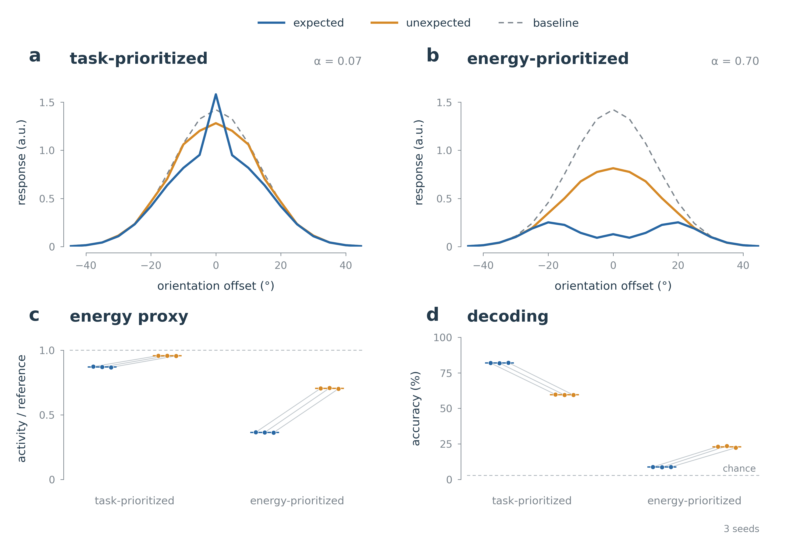
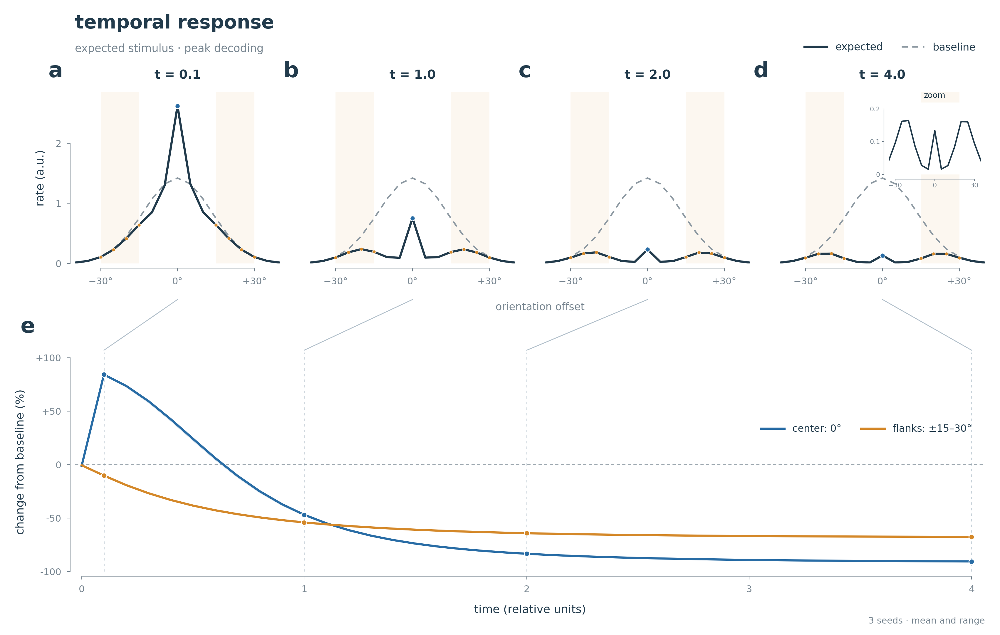

# task-prioritized, energy-prioritized, and temporal networks

a small orientation-selective rate circuit learns different response shapes
under task and activity pressure. this working tree packages the **three main
networks**, their checkpoints, numerical results, and reproduction code.

| network | setting | response |
|---|---|---|
| task-prioritized static | alpha .07 | expected center enhancement and flank suppression |
| energy-prioritized static | alpha .70 | strong expected-center suppression with relative flank sparing |
| temporal | alpha .30; peak decoding; uncapped 2×/3× starts | early enhancement followed by stronger proportional center suppression late |

**[the complete network guide](NETWORKS.md)** covers architecture, stimulus,
training, decoder definitions, results, usage, biological assumptions,
validation, and the outcomes of the earlier experiments.

the main temporal model rewards one label-free peak snapshot anywhere in the
stimulus window. both time constants are learned. 2× and 3× describe their
initial difference; the fitted difference grows to approximately 152×.
the result is initialization-dependent, and a small raw central peak remains
late despite greater proportional center suppression.

## quick start

from the repository root:

```bash
python -m pip install -r requirements.txt

CUDA_VISIBLE_DEVICES="" OMP_NUM_THREADS=2 MKL_NUM_THREADS=2 \
    python tools/evaluate_static.py

CUDA_VISIBLE_DEVICES="" OMP_NUM_THREADS=2 MKL_NUM_THREADS=2 \
    python tools/evaluate_temporal.py --init-ratio 2

CUDA_VISIBLE_DEVICES="" OMP_NUM_THREADS=2 MKL_NUM_THREADS=2 \
    python tools/evaluate_temporal.py --init-ratio 3
```

these evaluate all six static endpoints and all six temporal endpoints on cpu.
fresh results are written under `outputs/`. see the guide for retraining,
loading a single network, and interpreting each metric.

## main results



the static figure uses one pooled condition-blind decoder per checkpoint and
fold, tested on held-out velocity histories and noise. mean expected/unexpected
decoding is **82.00%/59.55%** for the task-prioritized network and
**8.74%/22.98%** for the energy-prioritized network.
the original population-vector measurements are retained separately.



both temporal starts produce the transition in all three seeds. early
center/flank responses are approximately **1.79/.85** times baseline; late
responses are **.10/.33**. selected-snapshot decoding is **49.2%**, next-stimulus
accuracy **80.3%**, and cycle activity **.545** times its fixed reference.
these temporal accuracy values use the training population-vector decoder,
so they are not directly comparable to the static figure's decoder.

## reproduce the figures

```bash
python tools/plot_static_networks.py
python tools/plot_learned_temporal.py --results results/temporal/init_2x.json
python tools/plot_learned_temporal.py --results results/temporal/init_3x.json \
    --out-dir outputs/temporal_figures_3x
```

the numerical results are in [results/static/main.json](results/static/main.json),
[results/temporal/init_2x.json](results/temporal/init_2x.json), and
[results/temporal/init_3x.json](results/temporal/init_3x.json).
historical and scratch network artifacts remain local and are excluded from
the main package; their scientific outcomes are documented in the guide.
